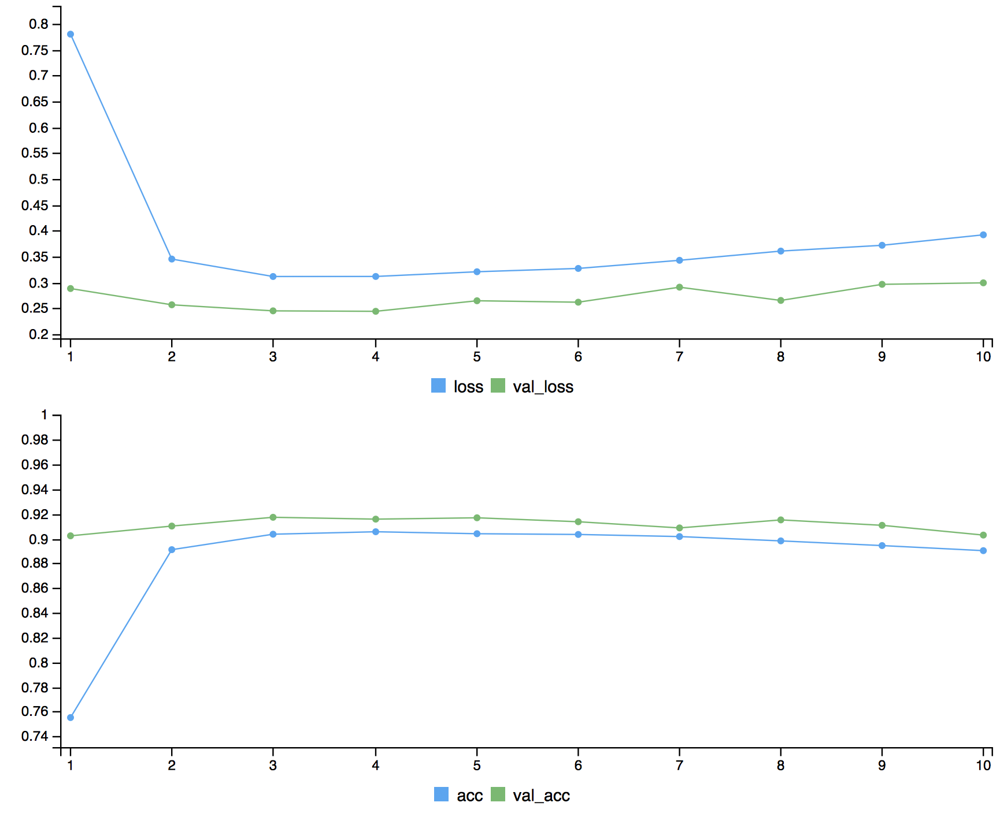

<!--
%\VignetteEngine{knitr::rmarkdown}
%\VignetteIndexEntry{The Homework 5 vignette}
-->

```{r setup, include=FALSE}
knitr::opts_chunk$set(echo = TRUE)
```

Note: Sorry that I set the codes of first two problems to 'eval=FALSE' to avoid warnings in Travis. To view the output of the code, please delete 'eval=FALSE' in each block.

#Problem 1
```{r,eval=FALSE}
#library(keras)
#install_keras()
library(keras)
library(glmnet)
library(moments)
library(ggplot2)
```

```{r,eval=FALSE}
# The data, shuffled and split between train and test sets
mnist <- dataset_mnist()
x_train <- mnist$train$x
y_train <- mnist$train$y
x_test <- mnist$test$x
y_test <- mnist$test$y

#Reshape the pixel matrix
x_train <- array_reshape(x_train, c(60000, 28^2))
x_test <- array_reshape(x_test, c(10000, 28^2))
y_train <- factor(y_train)
y_test <- factor(y_test)

#Model Performance 
#Without adding intensity as a feature
set.seed(1215)
s <- sample(seq_along(y_train), 1000)
fit <- cv.glmnet(x_train[s,], y_train[s], family = "multinomial")
preds <- predict(fit$glmnet.fit, x_test, s = fit$lambda.min, 
                 type = "class")
t <- table(as.vector(preds), y_test)
sum(diag(t)) / sum(t)
#0.8475

#Exploration of features
#Credit to http://apapiu.github.io/2016-01-02-minst/
intensity<-apply(x_train,1,mean)
label<-aggregate(intensity,by=list(y_train),FUN = mean)

#From the plot, we can see the mean of pixels of different digits seem 
#to be quite different
plot<-ggplot(data =label,aes(x=Group.1,y=x))+geom_bar(stat = "identity")
plot+scale_x_discrete(limits=0:9)+xlab("digit label")+ylab("average intensity")


kurtosis<-apply(x_train,1,kurtosis)
klabel<-aggregate(kurtosis,by=list(y_train),FUN = kurtosis)

#From the plot, we can see the kurtosis of pixels of different digits seem 
#to be quite different
plot<-ggplot(data = klabel,aes(x=Group.1,y=x))+geom_bar(stat = "identity")
plot+scale_x_discrete(limits=0:9)+xlab("digit label")+ylab("kurtosis")

skewness<-apply(x_train,1,skewness)
slabel<-aggregate(skewness,by=list(y_train),FUN = skewness)
#From the plot, we can see the skewness of pixels of different digits seem 
#to be quite different
plot<-ggplot(data = slabel,aes(x=Group.1,y=x))+geom_bar(stat = "identity")
plot+scale_x_discrete(limits=0:9)+xlab("digit label")+ylab("skewness")

intensity<-as.vector(intensity)
x_train<-cbind(x_train,intensity)
x_test<-cbind(x_test,as.vector(apply(x_test,1,mean)))

#Model Performance
#With intensity in the features
fit <- cv.glmnet(x_train[s,], y_train[s], family = "multinomial")
preds <- predict(fit$glmnet.fit, x_test, s = fit$lambda.min, 
                 type = "class")
t <- table(as.vector(preds), y_test)
sum(diag(t)) / sum(t)
#0.8476, slightly better than the original model

kurtosis<-as.vector(kurtosis)
x_train<-cbind(x_train,kurtosis)
x_test<-cbind(x_test,as.vector(apply(x_test,1,kurtosis)))

#With intensity and kurtosis in the features
fit <- cv.glmnet(x_train[s,], y_train[s], family = "multinomial")
preds <- predict(fit$glmnet.fit, x_test, s = fit$lambda.min, 
                 type = "class")
t <- table(as.vector(preds), y_test)
sum(diag(t)) / sum(t)
#0.8478, slightly better than the original model
```
In summary, after adding the average intensity(mean) and the kurtosis of the pixels, the model performance become a little bit better.

Also, we can try neural networks instead of LASSO to see if there will be a higher accuracy. Here is an example of CNN.
```{r,eval=FALSE}
# This code was taken from 
# https://keras.rstudio.com/articles/examples/mnist_cnn.html
library(keras)
# Data Preparation -----------------------------------------------------

batch_size <- 128
num_classes <- 10
epochs <- 2

# Input image dimensions
img_rows <- 28
img_cols <- 28

# The data, shuffled and split between train and test sets
mnist <- dataset_mnist()
x_train <- mnist$train$x
y_train <- mnist$train$y
x_test <- mnist$test$x
y_test <- mnist$test$y

# Redefine  dimension of train/test inputs
x_train <- array_reshape(x_train, c(nrow(x_train), img_rows, img_cols, 1))
x_test <- array_reshape(x_test, c(nrow(x_test), img_rows, img_cols, 1))
input_shape <- c(img_rows, img_cols, 1)

# Transform RGB values into [0,1] range
x_train <- x_train / 255
x_test <- x_test / 255

cat('x_train_shape:', dim(x_train), '\n')
cat(nrow(x_train), 'train samples\n')
cat(nrow(x_test), 'test samples\n')

# Convert class vectors to binary class matrices
y_train <- to_categorical(y_train, num_classes)
y_test <- to_categorical(y_test, num_classes)

# Define Model -----------------------------------------------------------

# Define model
model <- keras_model_sequential() %>%
  layer_conv_2d(filters = 32, kernel_size = c(3,3), activation = 'relu',
                input_shape = input_shape) %>% 
  layer_conv_2d(filters = 64, kernel_size = c(3,3), activation = 'relu') %>% 
  layer_max_pooling_2d(pool_size = c(2, 2)) %>% 
  layer_dropout(rate = 0.25) %>% 
  layer_flatten() %>% 
  layer_dense(units = 128, activation = 'relu') %>% 
  layer_dropout(rate = 0.5) %>% 
  layer_dense(units = num_classes, activation = 'softmax')

# Compile model
model %>% compile(
  loss = loss_categorical_crossentropy,
  optimizer = optimizer_adadelta(),
  metrics = c('accuracy')
)

# Train model
model %>% fit(
  x_train, y_train,
  batch_size = batch_size,
  epochs = epochs,
  validation_split = 0.2
)

scores <- model %>% evaluate(
  x_test, y_test, verbose = 0
)

# Output metrics
cat('Test loss:', scores[[1]], '\n')
cat('Test accuracy:', scores[[2]], '\n')
```
In summary, the accuracy of prediction of CNN on the test dataset(>85%) is higher than LASSO. However, in my computer, CNN runs really slow and comsumes far more times than LASSO. In my opinion, choosing between different methods is a trade of between loss, accuracy and time.

#Problem 2
I used a relatively small sample size and epoch of train data to get some intuitive idea about how I can adjust kernel size.
```{r,eval=FALSE}
#Some intuition: epoch = 2
#----------------------------------------------------#
#Train on 5600 random samples from the train set
#kernal_size=c(3,3)
#test loss:1.122483  test accuracy: 0.6841003 

#Train on 5600 random samples from the train set
#kernal_size=c(5,5)
#test loss: 1.002066  test accuracy: 0.702615  

#Train on 5600 random samples from the train set
#kernal_size=c(10,10)
#test loss: 1.881055  test accuracy: 0.4311102  

#----------------------------------------------------#
#Train on all samples from the train set
#kernal_size=c(10,10)
#test loss: 0.6365508  test accuracy: 0.8044462  

#Train on all samples from the train set
#kernal_size=c(5,5)
#test loss: 0.6365508  test accuracy: 0.8044462  

#----------------------------------------------------#
#From the above results, we can probably increase kernel size
#to about 5 to enhance accuracy

#Then the actual train set was used to verify my intuition. 
#I set epoch to 10 and drop-out rate to 0.25 this time

##Preparation
#library(keras)
#load("C:/Users/Yuhan/Desktop/Computational Stats/emnist_test.rda")
#load("C:/Users/Yuhan/Desktop/Computational Stats/emnist_train.rda")
x_train <-as.matrix(emnist_train[,-1])
x_test <-as.matrix(emnist_test[,-1])
y_train<-emnist_train[,1]
y_test<-emnist_test[,1]

x_train <- array_reshape(x_train, c(nrow(x_train), 28, 28, 1))
x_test <- array_reshape(x_test, c(nrow(x_test), 28, 28, 1))

# Transform RGB values into [0,1] range
x_train <- x_train/255
x_test <- x_test/255

cat('x_train_shape:', dim(x_train), '\n')
cat(nrow(x_train), 'train samples\n')
cat(nrow(x_test), 'test samples\n')

# Convert class vectors to binary class matrices
y_train <- to_categorical(as.matrix(y_train-1), num_classes = 26)
y_test <- to_categorical(as.matrix(y_test-1), num_classes = 26)

# Define Model -----------------------------------------------------------
model <- keras_model_sequential()
model %>%
  layer_conv_2d(filters = 32, kernel_size = c(5,5),
                input_shape = c(28, 28, 1),
                padding = "same") %>%
  layer_activation(activation = "relu") %>%
  layer_conv_2d(filters = 32, kernel_size = c(5,5),
                padding = "same") %>%
  layer_activation(activation = "relu") %>%
  layer_max_pooling_2d(pool_size = c(2, 2)) %>%
  layer_dropout(rate = 0.5) %>%
  layer_conv_2d(filters = 32, kernel_size = c(5,5),
                padding = "same") %>%
  layer_activation(activation = "relu") %>%
  layer_conv_2d(filters = 32, kernel_size = c(5,5),
                padding = "same") %>%
  layer_activation(activation = "relu") %>%
  layer_max_pooling_2d(pool_size = c(5,5)) %>%
  layer_dropout(rate = 0.25) %>%
  layer_flatten() %>%
  layer_dense(units = 128) %>%
  layer_activation(activation = "relu") %>%
  layer_dense(units = 128) %>%
  layer_activation(activation = "relu") %>%
  layer_dropout(rate = 0.25) %>%
  layer_dense(units = 26) %>%
  layer_activation(activation = "softmax")

# Compile model
model %>% compile(loss = 'categorical_crossentropy',
                  optimizer = optimizer_rmsprop(),
                  metrics = c('accuracy'))


# Train model
model %>% fit(
  x_train, y_train,
  epochs = 10,
  validation_data = list(x_test,y_test)
)

predict.train <- predict_classes(model, x_train)
predict.test <- predict_classes(model, x_test)

# Output metrics
cat('Train:', predict.train==emnist_train[,1], '\n')
cat('Test:', predict.test==emnist_test[,1], '\n')
```
Unfortunately, after adjusting drop-out rate to 0.25 and kernel size to c(5,5), I did not get a result better than the original parameters in the book. Specific values of accuracy and loss in each epoch can be found in picture 'prob2-prediction' in the vignette folder. I believe a good combination of drop-out rate and kernel size can help get a better accuracy, but sorry that the running speed of my computer couldn't handle to do more experiments. 


#Problem 3
Preparation
```{r}
library(ggplot2)
```

Functions are from Book CASL
MAD function
```{r}
# Create list of weights to describe a dense neural network.
#
# Args:
#     sizes: A vector giving the size of each layer, including
#
#
# Returns:
#     A list containing initialized weights and biases.
casl_nn_make_weights <- function(sizes){
  L <- length(sizes) - 1L
  weights <- vector("list", L)
  for (j in seq_len(L)){
    w <- matrix(rnorm(sizes[j] * sizes[j + 1L]),
            ncol = sizes[j],
            nrow = sizes[j + 1L])
    weights[[j]] <- list(w=w,
                     b=rnorm(sizes[j + 1L]))
  }
  weights
}
weight <- casl_nn_make_weights(c(1, 25, 1))
```

```{r}
# Apply a rectified linear unit (ReLU) to a vector/matrix.
#
# Args:
#     v: A numeric vector or matrix.
#
# Returns:
#     The original input with negative values truncated to zero.
casl_util_ReLU <- function(v){
v[v < 0] <- 0
v }
```

```{r}
# Apply derivative of the rectified linear unit (ReLU).
#
# Args:
#     v: A numeric vector or matrix.
#
# Returns:
#     Sets positive values to 1 and negative values to zero.
casl_util_ReLU_p <- function(v){
  p <- v * 0
  p[v > 0] <- 1
  p
}
```

```{r}
# Derivative of the mean absolute deviance (MAD) function.
#
# Args:
#     y: A numeric vector of responses.
#     a: A numeric vector of predicted responses.
#
# Returns:
#     Returned current derivative the MAD function.
casl_util_mse_p <- function(y, a){
  temp <- c()
  for(i in 1:length(a)){
    if( y[i] <= a[i]) 
      temp[i] <- 1
    else 
      temp[i] <- -1
  }
  temp
}
```

```{r}
# Apply forward propagation to a set of NN weights and biases.
#
# Args:
#     x: A numeric vector representing one row of the input.
#     weights: A list created by casl_nn_make_weights.
#     sigma: The activation function.
#
# Returns:
#     A list containing the new weighted responses (z) and
#     activations (a).
casl_nn_forward_prop <- function(x, weights, sigma){
  L <- length(weights)
  z <- vector("list", L)
  a <- vector("list", L)
  for (j in seq_len(L)){
  a_j1 <- if(j == 1) x else a[[j - 1L]]
  z[[j]] <- weights[[j]]$w %*% a_j1 + weights[[j]]$b
  a[[j]] <- if (j != L) sigma(z[[j]]) else z[[j]]
  }
  list(z=z, a=a)
}
```

```{r}
# Apply backward propagation algorithm.
#
# Args:
#     x: A numeric vector representing one row of the input.
#     y: A numeric vector representing one row of the response.
#     weights: A list created by casl_nn_make_weights.
#     f_obj: Output of the function casl_nn_forward_prop.
#     sigma_p: Derivative of the activation function.
#     f_p: Derivative of the loss function.
#
# Returns:
#     A list containing the new weighted responses (z) and
#     activations (a).
casl_nn_backward_prop <- function(x, y, weights, f_obj, sigma_p, f_p){
  z <- f_obj$z
  a <- f_obj$a
  L <- length(weights)
  grad_z <- vector("list", L)
  grad_w <- vector("list", L)
  for (j in rev(seq_len(L))){
    if (j == L) {
      grad_z[[j]] <- f_p(y, a[[j]])
      } else {
        grad_z[[j]] <- (t(weights[[j + 1]]$w) %*% grad_z[[j + 1]]) * sigma_p(z[[j]])
        }
    a_j1 <- if(j == 1) x else a[[j - 1L]]
    grad_w[[j]] <- grad_z[[j]] %*% t(a_j1)
    }
  list(grad_z=grad_z, grad_w=grad_w)
}
```

```{r}
# Apply stochastic gradient descent (SGD) to estimate NN.
#
# Args:
#     X: A numeric data matrix.
#     y: A numeric vector of responses.
#     sizes: A numeric vector giving the sizes of layers in
#            the neural network.
#     epochs: Integer number of epochs to computer.
#     eta: Positive numeric learning rate.
#     weights: Optional list of starting weights.
#
# Returns:
#     A list containing the trained weights for the network.
casl_nn_sgd <- function(X, y, sizes, epochs, eta, weights=NULL){
  if (is.null(weights)){
    weights <- casl_nn_make_weights(sizes)
  }
  ## for every individual, update the weights; repeat the procedure over all individuals.
  for (epoch in seq_len(epochs)){
    for (i in seq_len(nrow(X))){ 
      f_obj <- casl_nn_forward_prop(X[i,], weights, casl_util_ReLU)
      b_obj <- casl_nn_backward_prop(X[i,], y[i,], weights,
                                     f_obj, casl_util_ReLU_p, casl_util_mse_p)
      for (j in seq_along(weights)){
        weights[[j]]$b <- weights[[j]]$b -eta * b_obj$grad_z[[j]]
        weights[[j]]$w <- weights[[j]]$w -eta * b_obj$grad_w[[j]]
      }
    }
  }
  weights
}
```

```{r}
# Predict values from a training neural network.
#
# Args:
#     weights: List of weights describing the neural network.
#     X_test: A numeric data matrix for the predictions.
#
# Returns:
#     A matrix of predicted values.
casl_nn_predict <- function(weights, X_test){
  p <- length(weights[[length(weights)]]$b)
  y_hat <- matrix(0, ncol = p, nrow = nrow(X_test))
  for (i in seq_len(nrow(X_test))){
    a <- casl_nn_forward_prop(X_test[i,], weights, casl_util_ReLU)$a
    y_hat[i, ] <- a[[length(a)]]
    }
  y_hat
}
```

Simulate data
```{r}
set.seed(1215)
X <- matrix(runif(1000, min=-1, max=1), ncol=1)
s <- sample(1:1000, 100)
y<-rep(0,1000)
y[-s] <- X[-s,1,drop = FALSE]^2 + rnorm(900, sd = 0.1)
y[sort(s)] <- c(runif(50,-10,-5),runif(50,5,10))
y<-as.matrix(y)
plot(X,y)
```

Results for MAD
```{r}
weights <- casl_nn_sgd(X, y, sizes = c(1, 25, 1), epochs=15, eta=0.01)
y_pred_mad <- casl_nn_predict(weights, X)
```

```{r}
mse<-function(y_pred,y){
  mean((y_pred-y)^2)
}
mse(y_pred_mad,y)
```

```{r}
data_mad<-cbind(y,y_pred_mad,X)
plot_mad<-ggplot(as.data.frame(data_mad))+geom_point(aes(x=as.vector(X),y=y))
plot_mad+geom_line(aes(x=as.vector(X),y=y_pred_mad),colour = "darkblue",size =2)
```

Functions are from Book CASL
MSE function
```{r}
# Create list of weights to describe a dense neural network.
#
# Args:
#     sizes: A vector giving the size of each layer, including
#
#
# Returns:
#     A list containing initialized weights and biases.
casl_nn_make_weights <- function(sizes){
  L <- length(sizes) - 1L
  weights <- vector("list", L)
  for (j in seq_len(L)){
    w <- matrix(rnorm(sizes[j] * sizes[j + 1L]),
            ncol = sizes[j],
            nrow = sizes[j + 1L])
    weights[[j]] <- list(w=w,
                     b=rnorm(sizes[j + 1L]))
  }
  weights
}
weight <- casl_nn_make_weights(c(1, 25, 1))
```

```{r}
# Apply a rectified linear unit (ReLU) to a vector/matrix.
#
# Args:
#     v: A numeric vector or matrix.
#
# Returns:
#     The original input with negative values truncated to zero.
casl_util_ReLU <- function(v){
v[v < 0] <- 0
v }
```

```{r}
# Apply derivative of the rectified linear unit (ReLU).
#
# Args:
#     v: A numeric vector or matrix.
#
# Returns:
#     Sets positive values to 1 and negative values to zero.
casl_util_ReLU_p <- function(v){
  p <- v * 0
  p[v > 0] <- 1
  p
}
```

```{r}
# Derivative of the mean absolute deviance (MAD) function.
#
# Args:
#     y: A numeric vector of responses.
#     a: A numeric vector of predicted responses.
#
# Returns:
#     Returned current derivative the MAD function.
casl_util_mse_p <- function(y, a){
  2*(a-y)
}
```

```{r}
# Apply forward propagation to a set of NN weights and biases.
#
# Args:
#     x: A numeric vector representing one row of the input.
#     weights: A list created by casl_nn_make_weights.
#     sigma: The activation function.
#
# Returns:
#     A list containing the new weighted responses (z) and
#     activations (a).
casl_nn_forward_prop <- function(x, weights, sigma){
  L <- length(weights)
  z <- vector("list", L)
  a <- vector("list", L)
  for (j in seq_len(L)){
  a_j1 <- if(j == 1) x else a[[j - 1L]]
  z[[j]] <- weights[[j]]$w %*% a_j1 + weights[[j]]$b
  a[[j]] <- if (j != L) sigma(z[[j]]) else z[[j]]
  }
  list(z=z, a=a)
}
```

```{r}
# Apply backward propagation algorithm.
#
# Args:
#     x: A numeric vector representing one row of the input.
#     y: A numeric vector representing one row of the response.
#     weights: A list created by casl_nn_make_weights.
#     f_obj: Output of the function casl_nn_forward_prop.
#     sigma_p: Derivative of the activation function.
#     f_p: Derivative of the loss function.
#
# Returns:
#     A list containing the new weighted responses (z) and
#     activations (a).
casl_nn_backward_prop <- function(x, y, weights, f_obj, sigma_p, f_p){
  z <- f_obj$z
  a <- f_obj$a
  L <- length(weights)
  grad_z <- vector("list", L)
  grad_w <- vector("list", L)
  for (j in rev(seq_len(L))){
    if (j == L) {
      grad_z[[j]] <- f_p(y, a[[j]])
      } else {
        grad_z[[j]] <- (t(weights[[j + 1]]$w) %*% grad_z[[j + 1]]) * sigma_p(z[[j]])
        }
    a_j1 <- if(j == 1) x else a[[j - 1L]]
    grad_w[[j]] <- grad_z[[j]] %*% t(a_j1)
    }
  list(grad_z=grad_z, grad_w=grad_w)
}
```

```{r}
# Apply stochastic gradient descent (SGD) to estimate NN.
#
# Args:
#     X: A numeric data matrix.
#     y: A numeric vector of responses.
#     sizes: A numeric vector giving the sizes of layers in
#            the neural network.
#     epochs: Integer number of epochs to computer.
#     eta: Positive numeric learning rate.
#     weights: Optional list of starting weights.
#
# Returns:
#     A list containing the trained weights for the network.
casl_nn_sgd <- function(X, y, sizes, epochs, eta, weights=NULL){
  if (is.null(weights)){
    weights <- casl_nn_make_weights(sizes)
  }
  ## for every individual, update the weights; repeat the procedure over all individuals.
  for (epoch in seq_len(epochs)){
    for (i in seq_len(nrow(X))){ 
      f_obj <- casl_nn_forward_prop(X[i,], weights, casl_util_ReLU)
      b_obj <- casl_nn_backward_prop(X[i,], y[i,], weights,
                                     f_obj, casl_util_ReLU_p, casl_util_mse_p)
      for (j in seq_along(weights)){
        weights[[j]]$b <- weights[[j]]$b -eta * b_obj$grad_z[[j]]
        weights[[j]]$w <- weights[[j]]$w -eta * b_obj$grad_w[[j]]
      }
    }
  }
  weights
}
```

```{r}
# Predict values from a training neural network.
#
# Args:
#     weights: List of weights describing the neural network.
#     X_test: A numeric data matrix for the predictions.
#
# Returns:
#     A matrix of predicted values.
casl_nn_predict <- function(weights, X_test){
  p <- length(weights[[length(weights)]]$b)
  y_hat <- matrix(0, ncol = p, nrow = nrow(X_test))
  for (i in seq_len(nrow(X_test))){
    a <- casl_nn_forward_prop(X_test[i,], weights, casl_util_ReLU)$a
    y_hat[i, ] <- a[[length(a)]]
    }
  y_hat
}
```

Results for MSE
```{r}
weights <- casl_nn_sgd(X, y, sizes = c(1, 25, 1), epochs=15, eta=0.01)
y_pred_mse <- casl_nn_predict(weights, X)
```

```{r}
mse<-function(y_pred,y){
  mean((y_pred-y)^2)
}
mse(y_pred_mse,y)
```

```{r}
data_mse<-cbind(y,y_pred_mse,X)
plot_mse<-ggplot(as.data.frame(data_mse))+geom_point(aes(x=as.vector(X),y=y))
plot_mse+geom_line(aes(x=as.vector(X),y=y_pred_mse),colour = "red",size =2)
```

Comparison
```{r}
plot(as.vector(X), y, col="black" )
lines(as.vector(X), y_pred_mad, col="darkblue")
lines(as.vector(X),y_pred_mse, col="red")
```

From the plot, we can see that MAD function is more robust compared with MSE function when outliers exist. 